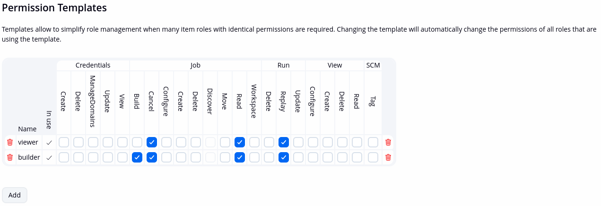

Role Strategy PatternMacros plugin
=================================

## Introduction

This aims to be a collection of various rolestrategy macros that can be used with Jenkins Role Strategy Plugin.

One of the issues with Jenkins Role Strategy Plugin together with an external OIDC realm is that you should create each group locally in Jenkins. This can be cumbersome when you have many groups, like in enterprise situations.
The AuthorizeByAuthority macro, for example, lets you match the user authorities in order to dynamically give access to specific pipelines with certain permissions.


## Usage

### Installing and enabling the plugin

The plugin needs Role Strategy plugin to be installed and configured. Once activated, it will enable several macros that will be available in the Role Strategy Macros page of Role Strategy Plugin.

### Configuring the plugin

The plugin actually does not have any configuration per se, but it exposes the macros to the Role Strategy Plugin. Each macro has different functions.

#### AuthorizeByAuthority Macro

This macro allows you to match user authorities in order to dynamically give access to specific pipelines.

Syntax is:

```shell
@AuthorizeByAuthority(template, style)
```

And you can optionally add a separator field as a third argument, which is, by default, the underscore `_` character.

To use it, configure a new permission template in the `Permission Template` section in the Role Strategy Plugin and give it a name.



The name of each template will identity a user `TEMPLATE` in AuthorizeByAuthority.

Then, in your external IdP, let's say a Keycloak, define roles for your users with an appropriate naming convention.

Presently you can use two different styles:

- PATTERN_TEMPLATE
- TEMPLATE_PATTERN

Where the PATTERN is what will be used to match your authority in the pipeline, and TEMPLATE is the name of the template you have defined above. For example, you assign your user the following roles in Keycloak:

- frontend-application_builder
- backend-cron_builder
- backend-module_viewer

And in Jenkins you have the following pipelines:

- pipeline-deployer-mytest-frontend-application
- pipeline-deployer-mytest-backend-cron
- pipeline-dependencies-my-backend-module
- pipeline-deployer-mytest-frontend-cron

Let's say you have defined two templates, named `viewer` and `builder` as above.

In the `Manage Roles` section of the Role Strategy Plugin, add two roles with the macro:

```
@AuthorizeByAuthority(viewer, PATTERN_TEMPLATE)
@AuthorizeByAuthority:2(builder, PATTERN_TEMPLATE)
```

Finally assign the two macros to `Authenticated Users` in the `Assign Roles` section of the `Role Strategy` plugin configuration:


When the user logs in, the `PATTERN` is extracted from each of his authorities (roles) and then matched against the available pipelines. If a match is found, the user is given the permission corresponding to the `TEMPLATE` block in their authority, for that match.

Using the PATTERN_TEMPLATE style for example, the `frontend-application_builder` role will match the `/frontend-application/` pattern on every pipeline, and if that matches, the given permissions will be taken from the `builder` Permission template. If you used the TEMPLATE_PATTERN, the role definition would be expected as reversed, like `builder_frontend-application`.

In the above case the user will have the `viewer` template assigned for the pipeline `pipeline-dependencies-my-backend-module`, and the `builder` template assigned for the pipelines `pipeline-deployer-mytest-frontend-application`, `pipeline-deployer-mytest-backend-cron`.

Both in a situation where pipelines are created by an administrator, automation or scripts, and there is no self service, or where the users can create their own pipeline, it's adviceable to enable naming convention checks on pipeline name definitions. You also can use the [ownership plugin](https://plugins.jenkins.io/ownership/) for self service pipeline creation access control.

## License

[MIT License](./LICENSE.md)